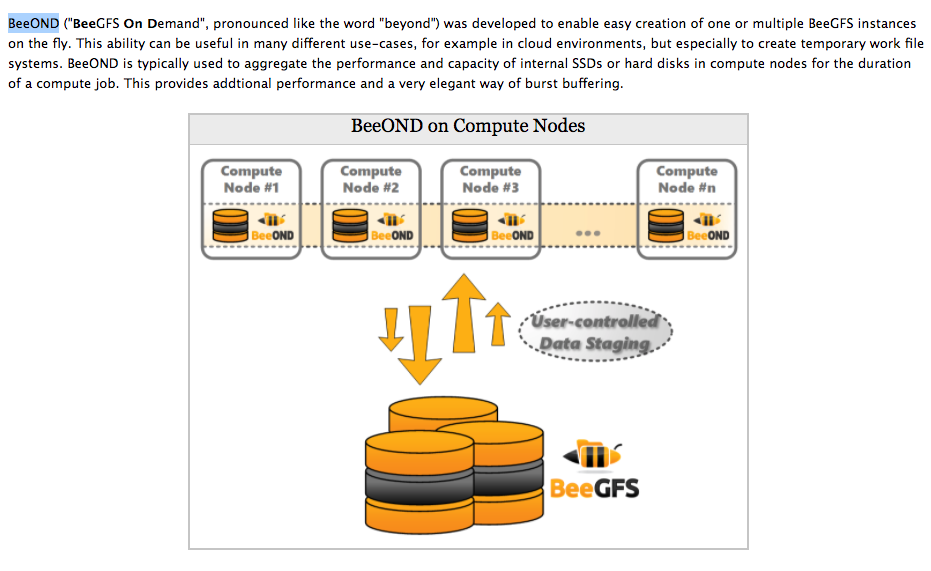
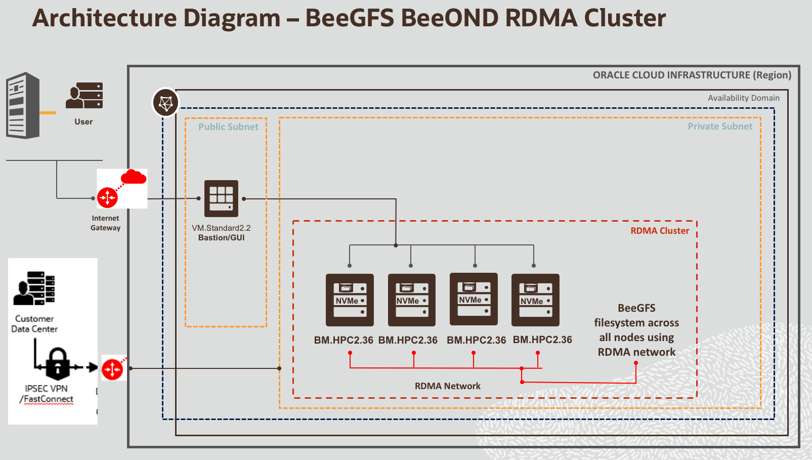
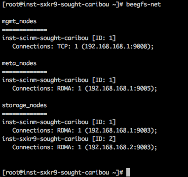
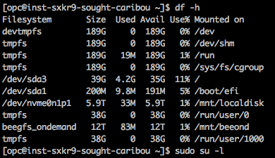
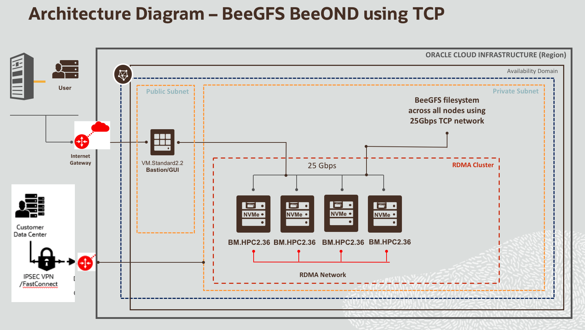
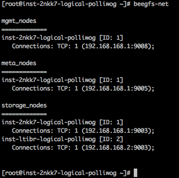
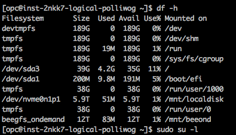

# oci-beegfs-beeond-rdma
Deploy BeeGFS BeeOND (BeeGFS ON Demand) on Oracle Cloud Infrastructure HPC 100Gbps RDMA Clustered Network. The template will do the following: 

- Provision a private clustered network using HPC baremeta nodes and 100 Gbps RDMA.  Use this template to deploy BeeGFS BeeOND on HPC nodes with clustered networking.   
- Create a BeeGFS BeeOND parallel filesystem using all the nodes in the cluster by leveraging the local NVMe SSD on each HPC node to create a single filesystem namespace.
- By default, all nodes will have a BeeGFS BeeOND Storage service & BeeOND client service running.  The first node, will also run Management and Metadata service, in addition to storage and client service.   You can override the default behavior using Terraform variables, see below [Customize-the-template](https://github.com/oracle-quickstart/oci-beegfs-beeond-rdma#customize-the-template) section. 
- By default, the filesystem is designed to use 100Gbps RDMA for filesystem traffic along with your HPC application traffic.  If we want to use 100Gbps RDMA only for your compute application traffic, then you can configure BeeOND to use 25Gbps network on the HPC nodes.      

## BeeGFS BeeOND (ON-Demand) License
BeeGFS/BeeOND requires license, reach out to [thinkparQ](https://thinkparq.com/) for license details. This github code is open source and its users responsibility to get the required license.

## What is BeeGFS BeeOND (ON-Demand)

*Quoted from https://www.beegfs.io/wiki/BeeOND#whatis


## High Level Architecture
###  Using RDMA network: 
The filesystem is designed to use 100Gbps RDMA for filesystem traffic along with your HPC application traffic.


####  RDMA network and mount point:




###  Using TCP network: 
The filesystem is designed to use 25Gbps TCP network for filesystem traffic, while the 100Gbps RDMA is used for HPC application traffic.    Set **use_beegfs_over_rdma to false** in terraform.tfvars or variables.tf file.   


####  TCP (25Gbps) network and mount point:




## Prerequisites
First off you'll need to do some pre deploy setup.  That's all detailed [here](https://github.com/oracle/oci-quickstart-prerequisites).

## Clone the Terraform template
Now, you'll want a local copy of this repo.  You can make that with the commands:

    git clone https://github.com/oracle-quickstart/oci-beegfs-beeond-rdma.git
    cd oci-beegfs-beeond-rdma/
    ls

## Customize the template 
Create a terraform.tfvars file and set values as per your needs.  We recommend to use terraform.tfvars to override values in variables.tf file.   Update values based on your AD,  # of nodes in a cluster, etc.    

- By default,  **use_beegfs_over_rdma is set to true** in variables.tf, so RDMA network will be used for BeeOND filesystem traffic.  
- Set **use_marketplace_image=true** in your terraform.tfvars file as shown below, To use OCI  HPC Cluster Network functionality, you need to use a custom marketplace image created by OCI HPC team.  The custom marketplace image is built using Oracle Linux UEK 7.6 image with OFED4.6.x drivers for 100Gbps RDMA cluster network and OCI-HPC utils.  We recommend using OS image using Oracle Linux UEK,  however if you need CentOS+OCI  HPC Cluster Network functionality, then reach out to OCI HPC team.  
- The variable,  **use_standard_image** only applies to what image to use for bastion node and doesn't apply for hpc node image.  If you plan to use a custom image for bastion, then set **use_standard_image** to false and set the **custom_bastion_image** variable to an Image OCID value. (ocid1.image.oc1.xxxxxxxxxx) 

```
           cat terraform.tfvars
           ad="kWVD:UK-LONDON-1-AD-1"
           bastion_ad="kWVD:UK-LONDON-1-AD-1"
           node_count=3
           boot_volume_size="100"
           use_existing_vcn=false
           use_custom_name=false
           use_marketplace_image=true
           metadata_node_count=2
           storage_node_count=2
           io500=false
           use_standard_image=true

```

In above example,  on a 3 node (**node_count=3**) BeeOND cluster, I am asking for 2 Metadata servers (**metadata_node_count=2**) instead of default of 1.  Also I am asking for only 2 Storage servers (**storage_node_count=2**) instead of the default of creating Storage servers on all nodes of the BeeOND cluster (In this example: 3)


## Deployment and Post Deployment
Deploy using standard Terraform commands

        terraform init
        terraform plan
        terraform apply 


